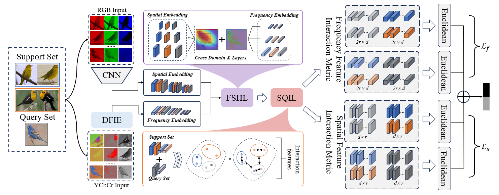

# FHNet
In the field of Few-shot fine-grained learning (FS-FGL), the main challenge we face is how to accurately capture discriminative feature representations with limited samples. Although many works have achieved good results, these works are generally based on feature aggregation data, and the effect is not satisfactory when dealing with feature discrete data. Therefore, a data set with discrete features is constructed in this study. From a methodological perspective, and based on the characteristics of different types of data sets, we summarize three challenges in the process of model construction: the first is the balance of FS-FGL, the second is the compatibility between discrete and aggregated data, and the last is the issue of high similarity among image subcategories. Based on this, we propose a frequency-guided hierarchical optimization network (FHNet) for few-shot fine-grained discrete and ensemble data. FHNet can use the complementary information of frequency domain and spatial domain to balance the learning of FS-FGL, adopt the hierarchical optimization strategy to deal with discrete features compatibilly, and finally effectively enlarge the between-class variance and reduce the within-class variance through the mutual learning of query and support. The experimental results on multiple few-shot fine-grained image datasets and FD-PDC show that FHNet is superior to the existing advanced methods in most cases, which proves its effectiveness and superiority in few-shot fine-grained image classification tasks.

# Framework

# Dataset
Our method is experimented on four datasets, namely CUB_200_2011, Stanford Dogs, Stanford Cars, and FD-PDC. After downloading the dataset, move it to the<code>./data<\code> directory.
<ul>
<li>[FD-PDC]</li>
</ul>
# Trainning
Training FHNet requires typing a command. In this example, we'll use CUB-200-2011 and ResNer-12 as our Backbone. If you need to adjust the parameters, check out <code>trainers/trainer.py<\code>.

    cd experiments/ResNet-12/train.py

